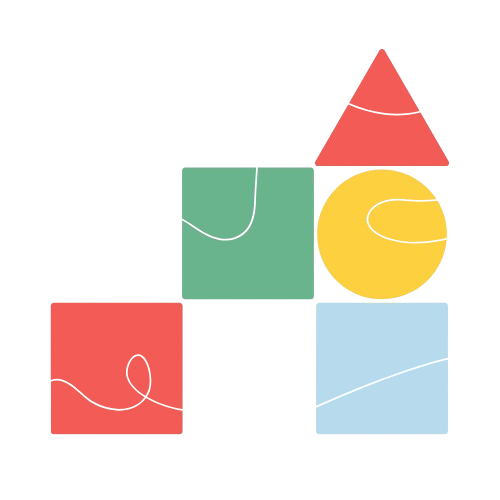
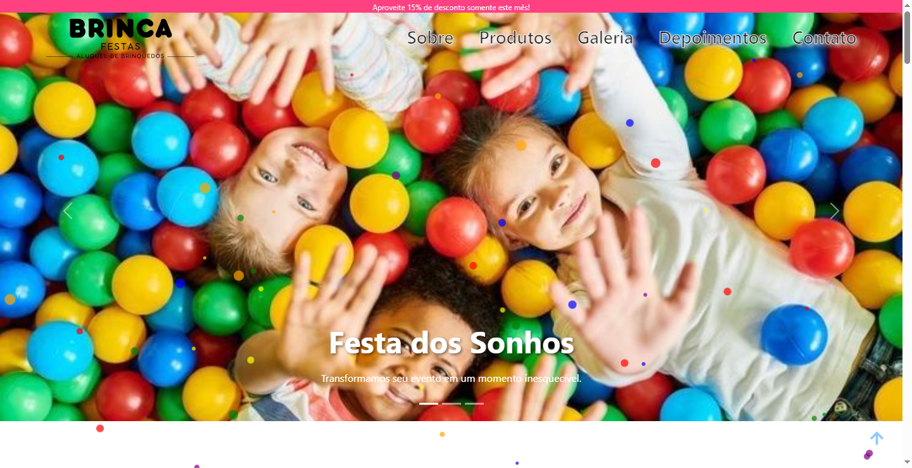

  

# Brinca Festa

Bem-vindo ao **Brinca Festa**, um template desenvolvido para empresas de animação e organização de festas infantis que desejam apresentar seus serviços de forma divertida e envolvente. O site foi criado com **React**, **Bootstrap** e **CSS**, proporcionando uma experiência moderna, intuitiva e responsiva para os clientes.

  

## 🎯 Objetivo

O principal objetivo deste projeto é fornecer um template adaptável para empresas de animação e organização de festas, permitindo que apresentem seus serviços de maneira visualmente atraente e prática. O site conta com seções como galeria de fotos, perguntas frequentes, um modal com localização, integração com redes sociais e carrossel de imagens na home.

O **Brinca Festa** é um site desenvolvido para divulgar os serviços de festas infantis e proporcionar uma navegação interativa e agradável. O projeto utiliza tecnologias modernas para garantir um design responsivo e acessível em diversos dispositivos.

### 🔹 Estrutura do Site:
- **Navbar**: Menu de navegação fixo para facilitar o acesso às seções.
- **Home**: Apresentação inicial com carrossel de imagens para destaque de festas.
- **Galeria**: Exibição de fotos das festas organizadas.
- **Perguntas Frequentes**: Respostas para as dúvidas mais comuns dos clientes.
- **Modal com Localização**: Localização da empresa em um modal interativo.
- **Redes Sociais**: Links para redes sociais da empresa.
- **Contato**: Formulário de contato com envio via **Email.js**.
- **Botão de Rolagem para o Topo**: Facilita a navegação, permitindo que o usuário volte rapidamente ao topo da página.

## 🛠️ Tecnologias Utilizadas

- **React**: Biblioteca JavaScript para interfaces dinâmicas e reativas.
- **CSS**: Estilização e personalização do layout.
- **Bootstrap**: Framework CSS para design responsivo.
- **JavaScript**: Interatividade e manipulação de dados na interface.
- **HTML5**: Estruturação do conteúdo da página.
- **Email.js**: Envio de mensagens no formulário de contato sem necessidade de backend.

## ⚙️ Funcionalidades

- **Galeria de Fotos**: Exibição organizada das festas realizadas, com fotos dos eventos.
- **Perguntas Frequentes**: Respostas para as dúvidas mais comuns, melhorando a experiência do cliente.
- **Modal com Localização**: Modal interativo com a localização da empresa.
- **Carrossel de Imagens na Home**: Destaque de imagens das festas na página inicial.
- **Redes Sociais**: Integração com redes sociais, permitindo que os clientes sigam e interajam com a empresa.
- **Formulário de Contato**: Formulário funcional com envio via **Email.js**.
- **Botão de Rolagem para o Topo**: Facilita a navegação.
- **Design Responsivo**: Otimizado para diferentes dispositivos.

## 🤝 Contribuições

Contribuições são bem-vindas! Para contribuir:

- **Abra uma Issue**: Relate um bug ou sugira melhorias.
- **Crie um Pull Request**: Faça alterações e envie para revisão.

## 📧 Contato

Para dúvidas ou feedback, entre em contato:

- **E-mail**: [nina.kastro@icloud.com](mailto:nina.kastro@icloud.com)
- **LinkedIn**: [LinkedIn](https://www.linkedin.com/in/karinacmartins/)
- **GitHub**: [GitHub](https://github.com/karinacmartins)

## Observações

Este projeto é um **template para empresas de animação e organização de festas infantis**, podendo ser facilmente adaptado para diferentes necessidades. O objetivo é oferecer uma solução prática e moderna para a apresentação de serviços e comunicação com clientes.

 
 

Made with 💜 by <a href="https://github.com/karinacmartins">KM</a>.

